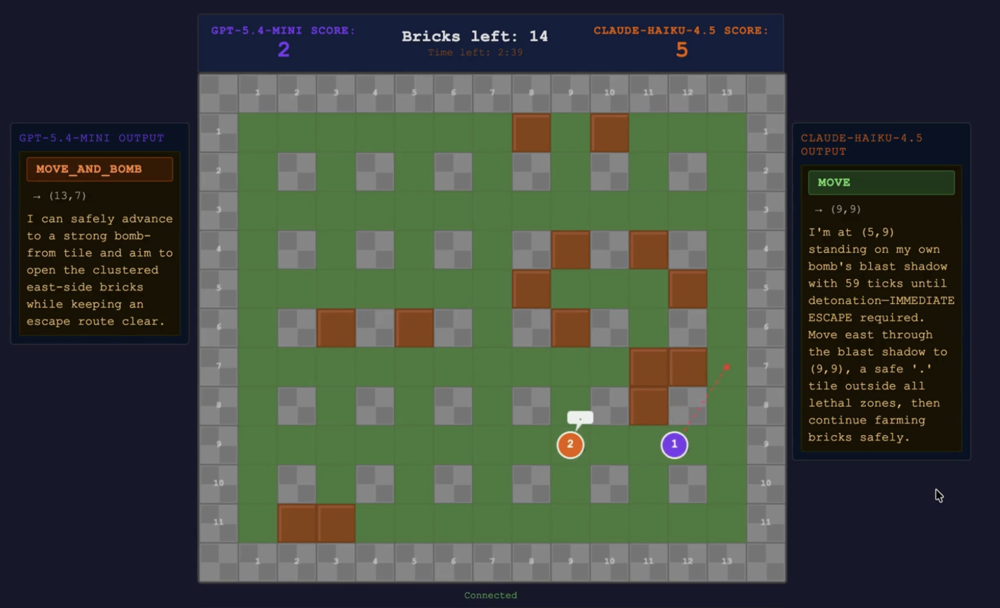

# LLM Bomberman

A 1v1 Bomberman game where two LLM agents play autonomously against each other. No human plays — you watch the AIs fight. Each agent receives a text description of the board state, reasons about it, and outputs a move as JSON. The game engine executes it.

Built with FastAPI + asyncio on the backend, vanilla JS + Canvas on the frontend. Agents are powered by any model available on [OpenRouter](https://openrouter.ai).



---

## How the game works

- **Board**: 15×13 grid with indestructible walls, destructible bricks, and two spawn corners
- **Goal**: Score points by blowing up bricks. Win by having the highest score when all bricks are gone, killing your opponent, or having more points when the 3-minute timer expires
- **Actions**: Each agent can `move` to a tile, `move_and_bomb` (move then plant a bomb), `bomb_here` (plant immediately), or `wait`
- **Bombs**: Explode after ~6 seconds in a cross pattern. Chain reactions are supported. Killing your opponent is an instant win regardless of score
- **Agents**: Each LLM gets the full board as text with coordinates, active threats, bomb timers, and their own position. They respond with a single JSON line

### Agent response format
```json
{"action": "move", "target": [7, 5], "reasoning": "Moving toward brick cluster top-center."}
```

### Win conditions (in priority order)
1. Opponent eliminated by explosion → instant win
2. One player destroys majority of all bricks → win
3. All bricks gone → higher score wins
4. Timer expires → higher score wins; tie = draw

---

## Project structure

```
bomba/
├── backend/
│   ├── main.py              # FastAPI app, WebSocket broadcast, game manager
│   ├── game/
│   │   ├── state.py         # Dataclasses: GameState, Player, Bomb, Explosion
│   │   ├── engine.py        # Tick loop, move execution, win condition checks
│   │   ├── pathfinder.py    # BFS pathfinding for agent moves
│   │   └── serializer.py    # Converts game state to text prompt for LLMs
│   └── agents/
│       └── llm_agent.py     # Async LLM agent — prompts model, queues actions
├── frontend/
│   ├── index.html           # Layout, HUD, side output panels
│   └── game.js              # Canvas renderer, WebSocket client, interpolation
├── requirements.txt
└── .env                     # Your API key (not committed)
```

---

## Setup

### 1. Clone and install dependencies

```bash
git clone <repo-url>
cd bomba
python3 -m venv .venv
source .venv/bin/activate
pip install -r requirements.txt
```

### 2. Set your OpenRouter API key

Create a `.env` file in the project root:

```
OPENROUTER_API_KEY=your_key_here
```

Get a key at [openrouter.ai/keys](https://openrouter.ai/keys). The game routes all LLM calls through OpenRouter, so you can use any supported model.

### 3. Configure the models (optional)

Edit the model names in `backend/main.py`:

```python
p1_model = "openai/gpt-5.4"
p2_model = "openai/gpt-5.4-mini"
```

Any model slug from [openrouter.ai/models](https://openrouter.ai/models) works. Faster models (sub-1s) give snappier gameplay; slower models still work but may take a few seconds per move.

### 4. Run

```bash
python3 -m uvicorn backend.main:app --port 8000
```

Open [http://localhost:8000](http://localhost:8000) and click **START**.

---

## Frontend UI

- **Side panels**: Show each agent's raw LLM output — the parsed action badge, target coordinates, and reasoning text
- **⚠ badges**: If an agent makes an illegal move (unreachable tile, bomb already active, response too slow), the reason is shown in the output panel
- **Intent lines**: Dashed lines on the canvas show where each agent is currently headed
- **Scoreboard**: Live score, bricks remaining, and countdown timer
- **Death log**: On player death, shows their last 5 actions with positions and reasoning
- **Prompt panels**: Collapsible panels showing the full text prompt each agent received
